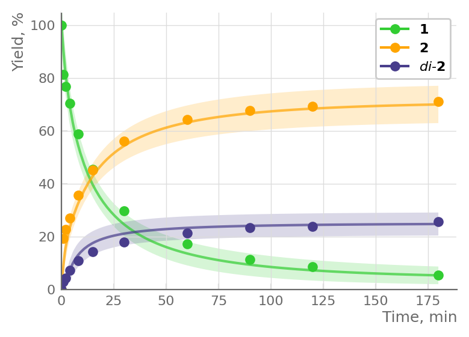

# WFI data processor
A data processor for chemical reaction timecourses that provides weighted error range / fitting indices calculations and interactive chart visualization.

## Purpose
This tool has been developed as a part of research on mechanism-oriented kinetic analysis of chemical reactions to help organic chemists 
visualize the relationship between simulation and experimental results, thereby enabling investigation of the extrapolability of the kinetic model.  
It is specially designed to support synthetic organic chemists who may not be quite familiar with analyzing reaction mechanisms through physical calculations 
rather than utilizing curly arrows and dots. By encapsulating mathematical flavour and automatic processing of user-friendly Excel data, the tool allows users
with deep chemical knowledge to focus on chemistry rather than calculation details.

## Output samples


## Installation
If you have python environment in your local, try
```bash
git clone https://github.com/saoxxxv/WFIdataprocess.git
cd WFIdataprocess
pip install -r requirements.txt
streamlit run src/Top.py
```
Or, simply access web app ran on Streamlit cloud

```
Currently under construction
```

## Usage
See Usage page shown in sidebar for input data format etc.

## License
This project is dual-licensed:  
- **AGPLv3** for academic and non-commercial use.  
- **Commercial licenses** are available upon request.

See the [LICENSE](./LICENSE) file for open source terms.  
For commercial licensing, see [COMMERCIAL_LICENSE.md](./COMMERCIAL_LICENSE.md).  

## Citation
Cite this work as:  
Orito, Y.  _ACS Omega_ **2025**, _10_, 9266–9274. https://doi.org/10.1021/acsomega.4c09609.

## Contact
For bug reports, feature requests, or commercial inquiries, please contact:  
Yuya Orito  
[saoxxxv@gmail.com]
